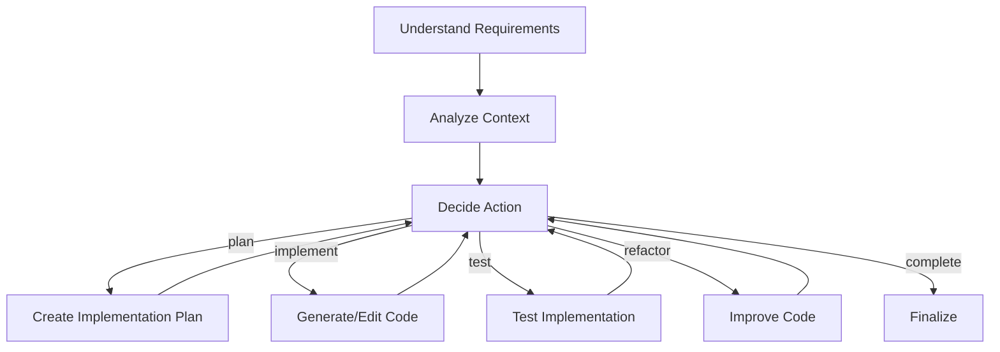

# Design Doc: Claude Code Subagent

> A coding agent that leverages Claude Code SDK with PocketFlow abstractions for automated code generation and project implementation

## Requirements

Claude Code Subagent is designed to:
- Accept high-level coding tasks and break them down into actionable steps
- Use Claude Code SDK to generate, edit, and manage code files
- Follow the Agentic Coding methodology (humans design, agents code)
- Support iterative development with error handling and self-correction
- Provide clear feedback on progress and decisions made

## Flow Design

### Applicable Design Pattern:

1. **Agent Pattern**: The system acts as an autonomous agent that makes decisions based on context
   - *Context*: Project requirements, existing code, current state
   - *Actions*: plan, implement, test, refactor, complete

2. **Workflow Pattern**: Sequential processing of coding tasks
   - Planning → Implementation → Testing → Refinement

### Flow high-level Design:



## Utility Functions

1. **Claude Code Interface** (`utils/claude_interface.py`)
   - *Input*: prompt (str), options (ClaudeCodeOptions)
   - *Output*: response (str) or structured data
   - Handles communication with Claude Code SDK

2. **Code Analyzer** (`utils/code_analyzer.py`)
   - *Input*: directory path (str)
   - *Output*: project structure and context (dict)
   - Analyzes existing codebase for context

3. **Task Decomposer** (`utils/task_decomposer.py`)
   - *Input*: high-level task (str), context (dict)
   - *Output*: subtasks list (list[dict])
   - Breaks down complex tasks into manageable steps

4. **Code Validator** (`utils/code_validator.py`)
   - *Input*: code files (list[str])
   - *Output*: validation results (dict)
   - Checks for syntax errors and basic issues

## Node Design

### Shared Store

```python
shared = {
    "task": "User's coding task description",
    "context": {
        "project_path": "/path/to/project",
        "existing_files": [],
        "dependencies": [],
        "constraints": []
    },
    "plan": {
        "steps": [],
        "current_step": 0
    },
    "implementation": {
        "files_created": [],
        "files_modified": [],
        "errors": []
    },
    "history": [],  # Track all actions taken
    "state": "initial"  # Current agent state
}
```

### Node Steps

1. **UnderstandRequirements** (Node)
   - *Purpose*: Parse and understand the user's coding task
   - *Type*: Regular
   - *Steps*:
     - *prep*: Read "task" from shared store
     - *exec*: Call Claude to analyze requirements
     - *post*: Write parsed requirements to "context" in shared store

2. **AnalyzeContext** (Node)
   - *Purpose*: Analyze existing codebase and project structure
   - *Type*: Regular
   - *Steps*:
     - *prep*: Read "context.project_path" from shared store
     - *exec*: Use code_analyzer utility to scan project
     - *post*: Update "context" with project analysis

3. **DecideAction** (Node)
   - *Purpose*: Determine next action based on current state
   - *Type*: Regular
   - *Steps*:
     - *prep*: Read entire shared store for context
     - *exec*: Use Claude to decide next action
     - *post*: Return action name for flow branching

4. **CreatePlan** (Node)
   - *Purpose*: Generate implementation plan
   - *Type*: Regular
   - *Steps*:
     - *prep*: Read "task" and "context" from shared store
     - *exec*: Use task_decomposer to create step-by-step plan
     - *post*: Write plan to "plan" in shared store

5. **ImplementCode** (AsyncNode)
   - *Purpose*: Generate or modify code files
   - *Type*: Async
   - *Steps*:
     - *prep_async*: Read current plan step and context
     - *exec_async*: Use Claude Code SDK with file tools
     - *post_async*: Update "implementation" with changes

6. **TestImplementation** (AsyncNode)
   - *Purpose*: Test the generated code
   - *Type*: Async
   - *Steps*:
     - *prep_async*: Read implementation details
     - *exec_async*: Run tests using Claude Code's Bash tool
     - *post_async*: Store test results and errors

7. **RefactorCode** (AsyncNode)
   - *Purpose*: Improve code based on test results or requirements
   - *Type*: Async
   - *Steps*:
     - *prep_async*: Read errors and improvement suggestions
     - *exec_async*: Use Claude Code to refactor
     - *post_async*: Update implementation with improvements

8. **FinalizeProject** (Node)
   - *Purpose*: Complete the task and generate summary
   - *Type*: Regular
   - *Steps*:
     - *prep*: Read entire implementation history
     - *exec*: Generate completion report
     - *post*: Write final status and summary